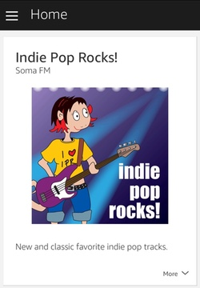
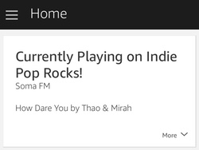

# Soma FM for Alexa
Play [Soma FM](https://somafm.com) channels on Alexa! Over 30 unique channels of listener-supported, commercial-free, underground/alternative radio broadcasting to the world. All music hand-picked by SomaFM's award-winning DJs and music directors. If you enjoy what you're hearing on Soma FM please _**[support them](https://somafm.com/support/)**_!

## Motivation
I love Soma FM and while channels are available with Alexa via TuneIn they're not always easy to dig out. It seemed to me that the easiest way to reliably summon BAGeL Radio and Lush to my Echo was to create a Soma FM specific skill. Additionally I wanted to try cutting my teeth on Alexa Skill development. Two birds with one stone! This skill is not (yet) published so to use it you will have to have a developer account with Amazon and be somewhat comfortable deploying a new skill to Lambda. A nice getting started guide is [here](https://developer.amazon.com/blogs/post/Tx3DVGG0K0TPUGQ/New-Alexa-Skills-Kit-Template:-Step-by-Step-Guide-to-Build-a-Fact-Skill).

## What Can it Do?
### Play a Channel
_**Alexa ask Soma FM to play Indie Pop Rocks!**_ - Plays Indie Pop Rocks! Substitute you favorite station and away you go!

After the channel starts you'll see the following card in the Alexa app.



### Tell You What Song is Currently Playing
_**Alexa ask Soma FM what song is playing?**_ - Responds with the song title and artist of the currently playing song -> _"This is How Dare You by Thao & Mirah"_

We'll jot that down on a card so you can come back to it later if you like.



### Tell You What the Most Popular Stations Are
_**Alexa ask Soma FM what's popular?**_ - Responds the most popular channels -> _"The most popular stations ranked by current listeners are Groove Salad, Drone Zone, and Space Station Soma"_

I mean, outside of the holidays, that's usually the three you'll hear in my experience but it's nice for someone new to Soma FM.

## Things to be Aware of
- The channel list is currently hard coded so if a new one launches a code change will be required. Maybe I'll get access to the real API and rectify this in the future.
- Alexa hears _"SF 10-33"_ as _"SF 10 to 33"_. I haven't figured out a way to allow other phrasing (hyphen, dash) without bad things happening. I did put an additional phrase in there so you can call it with _"SF Scanner"_.

## How Do I Build It?
It may be helpful to walk through the [audio player example](https://github.com/alexa/skill-sample-nodejs-audio-player) to make sure you have everything set up correctly. That said, here is the short version.

```shell
cd js
npm build
zip -r ../soma.zip
```
Then just upload it to Lambda.